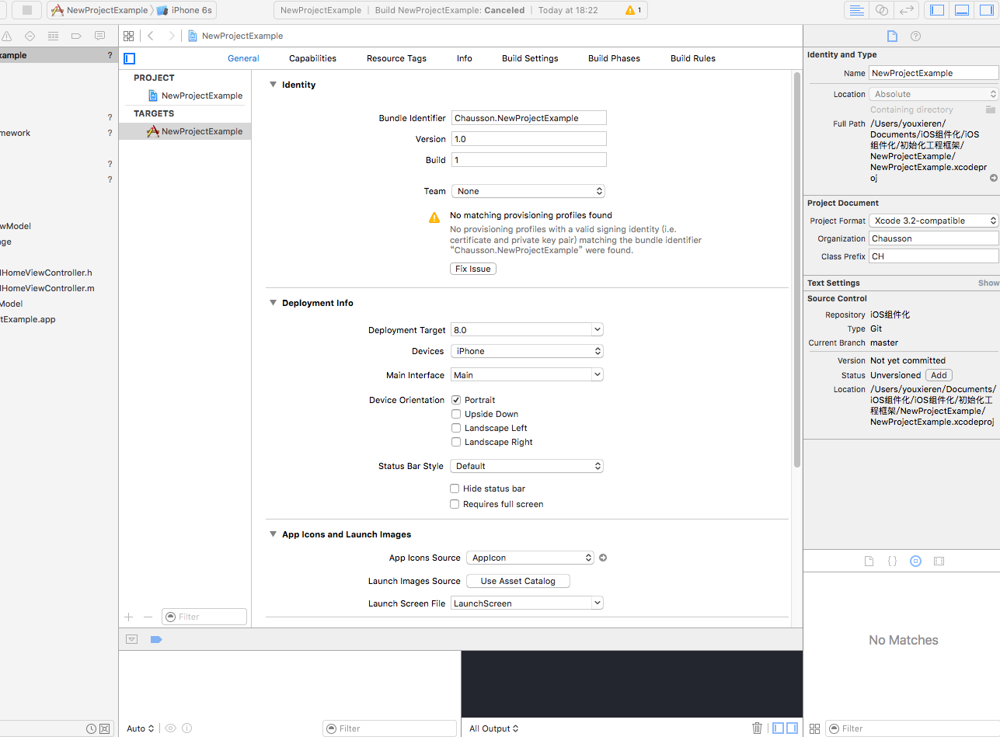

# 说明

1.所有iOS新建工程使用此项目来初始化工程，demo在此文件中 可以查看参考，其中引入通用的文件结构，pod导入基础框架CHNetworking,CHProgressHUD,Mansory,JSONModel,MJRefresh,SDWebImage

2.所有工程需要先安装xunique，具体安装使用说明参照如下链接https://github.com/truebit/xUnique,注意需要在Build Run Script中加入以下脚本xunique "{PROJECT_FILE_PATH}/project.pbxproj"(project工程的路径)

3.初次提交需要忽略pod下面所有文件信息,只需要提交podfile文件即可

4.在初始化工程使用中可以直接拿该项目修改，需要把工程名称改成项目名称参考以下:
http://www.cocoachina.com/ios/20150104/10824.html

5.工程中需要修改SCHEME名称参照如下链接
http://blog.csdn.net/lvxiangan/article/details/44184743

6.在Project Document 中Class Prefix增加类名前缀，默认是CH
 

